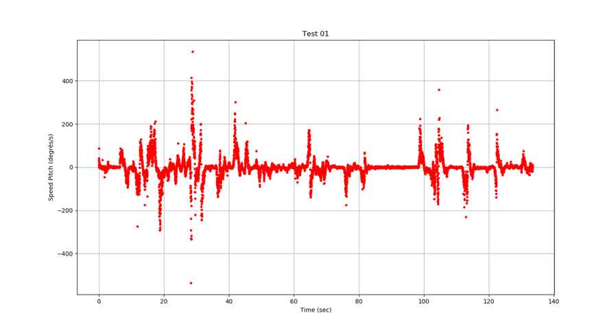

# ConcorAI_Ubisoft_Research

As part of a partnership with Ubisoft and Galilei, the proposed mandate was based on the integration of artificial intelligence (AI) into an environment using virtual reality (VR) and augmented reality (AR). This trio forms what is called an XR environment. The present project focuses on the creation of a model involving artificial intelligence to analyze possible feelings of the coming from the player with the main parameter: the movement of the head.

The Unity package can be download here :

https://drive.google.com/open?id=1_Wyussq6genP0pa9YU76bID3O5P-T_5O

## context 

This document traces the evolution of the work until the delivery of a final prototype. It will cover the following aspects: the detection of excitement, the prediction of a yes/no movement, the gaze perception of the player and style transfer RNN in VR world.

## Starting point 

Livingstone  shown that when speaking or singing, vocalists often move their heads in an expressive fashion, yet the influence of emotion on vocalists' head motion is unknown. Their results provide the first evidence that head movements encode a vocalist's emotional intent and that observers decode emotional information from these movements. 

In the same logic, the following hypothesis has been formulated: By measuring the variations of the movement of the head, it is possible to deduce the speed of the latter in the three axes of rotation and to extract information from it to characterize the emotions of the player.

## Player’s concentration

Initially, the project focused on real-time recording of the movements of a player's head in a known and controlled environment in Unity. The environment was the projection of a video in which the player was in a wheat field. Surprisingly, a person appeared in the scene and was getting closer and closer to the player in order to create a feeling of stress and fear. 

Figure 1 shows that there are peaks of speed as a function of time along a well-defined axis of rotation. These moments are in line with the appearance of a character in the scene. It is therefore possible to correlate a very high level of attention of a player in a scene by measuring the movements of the head. 
Figure 1  - Speed head vs time around one axis 

## Gaze perception

The next step was to try to understand how people see objects and which ones retain the attention. This process can be affected by:
- Number of objects in view
- Proximity of objects
- Size of objects
- Contrast in light / color
- Movement
- Surprise / Unexpected
- Familiar / Unknown
- Importance towards reaching a goal

For this, a score has been assigned to each object present in the scene. This score grows if the player meets one of two criteria: Looking for a longer time/Getting closer. The assumption made here is that the object with the highest score is the one that has the most attention of the player. 

## Model AI Yes/No

After collecting a certain amount of data, the challenge was to design and train an appropriate machine learning model which accurately predicts if the user answers yes/no the question by measuring the speed of the head. A feed-forward model was selected.
Input layer:
The format is a vector of 40 values of speeds around one axis of rotation equivalent to ~1 sec. Considering the fact the a yes and a no are axis-independent, two models were created.
Hidden layers:
The neural network contains only 4 hidden layers, and after fine-tuning the hyperparameters, contains 2 dropout functions. These models provide around 85% of accuracy.
Output layer:
The output is a binary value created by the softmax function

## Style Transfer Learning

Finally, a second method related to artificial intelligence was used in this project. Although it is not related to the main subject of head movement analysis, it creates a very interesting effect within Unity. This method is known as Neural Style Transfer

The principle of neural style transfer is to define two distance functions, one that describes how different the content of two images are, Lcontent, and one that describes the difference between the two images in terms of their style, Lstyle. Then, given three images, a desired style image, a desired content image, and the input image (initialized with the content image), it is possible to transform the input image to minimize the content distance with the content image and its style distance with the style image.

Below, a picture of Chicago before and after the neural style transfer by « the scream » paint.
Figure 3 - Picture before and after style transfer learning
 
  

## Unity Integration 

The integration of the project consisted of three scenarios. The first part put the player face to a Boolean choice. This one could choose to open the doors and continue the game. For this, an ML algorithm studies the answer and according to the percentage of confidentiality executes an action. In the second scenario, different works of art were exhibited and according to the time spent on each of the works a score was calculated. The interface then asked specific questions depending on what was viewed. In the last scenario, the project wants to make the transfer learning technique interactive. For that, 3 questions were asked to know if the player wanted to place objects in the table or not. According to these answers, the final table will evolve.

Figure 4 & 5 - Screenshots of the secenario
 
                       
## Lessons learned

The main challenge in this project has been the lack of data available in relation to the movement of the head. It seems that this is a subject still little explored. Moreover, faced with the complexity of the problem, analyzing only the movement of the head is not enough to define the emotions perceived by a player. Combine that with the gesture of the hands and the voice seems primordial. It would also be interesting in the future to integrate the movement of the pupil.

